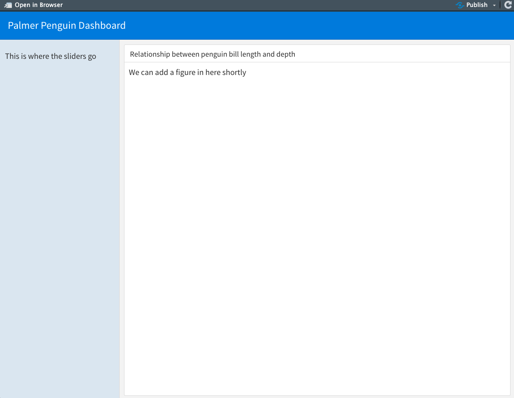

# Flexdashboard 

To start, we are going to focus on `flexdashboard`: a package for creating sleek 'dashboard' pages. The basic idea of the dashboard is that you can have any number of blocks that hold different information, across one or several tabs or pages. Several different types of layouts (and how to code them in Rmd) can be viewed on the [Flexdashboard layout page](https://rstudio.github.io/flexdashboard/articles/layouts.html). 

To get started, open up a blank Rmd document and paste in the following: 

```
---
title: 'Palmer Penguin Dashboard'
output:
  flexdashboard::flex_dashboard:
---

<!--- We are in Rmd so hash tags don't work as comments. They denote different
     levels of headers. Instead use these --->

<!--- ## symbol is a formatting header, but these don't actually get header names.
      Instead you specify the shape you want with either Column or Row.
      The {.sidebar} addition is a special format for where folks usually
      put sidebars. We'll see how different this looks in a moment.
      Other shape specifications can do inside the curly brakcets. --->

## Column {.sidebar}

This is where the sliders go

## Column

<!--- ### symbol is where you can actually give blocks names --->
### Relationship between penguin bill length and depth

We can add a figure in here shortly

```

Notice these important elements: 

* YAML: The part that starts and ends with three dashes `---` is something special to Rmds. This is true also if you've worked with Rmds to make 'notebooks' or PDF docments. The YAML specifies metadata about the document and its format. For our sake, the new things you'll see are that we add an output specification to `flexdashboard::flex_dashboard:` 
* Comments: You probably know that to comment in R scripts, we use hashtags (#). But because hashtagssignify headers in markdown language, we use arrows and dashes to comments on `<!--- info I want to omit --->` 
* Headers: Because hashtags mean headers, we use them to denote nested headings. In the dashboard, the title in the YAML is implicitly the first header (#) and so we start with secondary headers (##) to identify the formatting shapes in the dashboard, using the words 'Column' or 'Row'. We can give the format special instructions after the secondary headers inside curly brackets {}. Then actual headers of the different blocks start with tertiary headers (###)

If we hit the **knit** button, we should render something like this:

```{r, echo = F, out.width = "100%", fig.pos = "center"}

```

Now, take a look at the [layout formatting webpage](https://rstudio.github.io/flexdashboard/articles/layouts.html) and play around a little. For instance:  

* How do you add more boxes? 
* What happens if you add a 'Row' like you did a 'Column'? 
* How can you add another tab?  

These are generally easy-enough to learn through looking through the page linked above, so we won't dwell here. 
