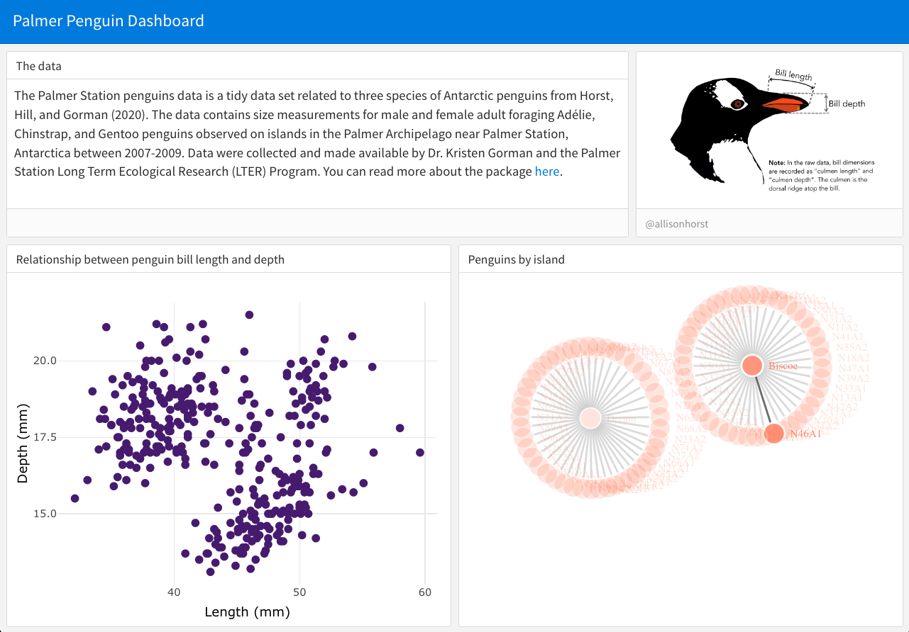

# Static interaction 

So far, our dashboard doesn't have any content -- we only have boxes and some text. What we want to do next is add in a figure so that we can work towards interactivity. Our first focus will be on plots that can be interacted with using wrapper functions like `plotly` and `networkD3`, but aren't actually dynamic -- meaning they don't respond to the user yet.

For instance, you might want to just show off some graphs and let folks have a peek at the underlying data, but not actually change the shape or variables represented in the data. Here are some examples: 

* https://testing-apps.shinyapps.io/flexdashboard-dygraphs/
* https://testing-apps.shinyapps.io/flexdashboard-highcharter/

Note that there are loads of examples, all of which share source code (!), available through [`flexdashboard`](https://rstudio.github.io/flexdashboard/articles/examples.html).  

To add in figures we can insert code chunks to our Rmd. As in other Rmd formatting, we can also insert a setup chunk where we load in our packages. Feel free to paste in all of this code to your Rmd document again, or paste only the new code chunk. 

````{verbatim}
---
title: 'Palmer Penguin Dashboard'
output:
  flexdashboard::flex_dashboard:
---

```{r, echo = F, warning = F, message = F}
library(tidyverse)
library(palmerpenguins)
library(plotly)
```

## Column {.sidebar}

## Column

### Relationship between penguin bill length and depth
  
```{r}
ggplot(penguins, aes(x = bill_length_mm, y = bill_depth_mm)) +
  geom_point(size = 3, color = "#51127C") +
  theme_minimal() +
  labs(x = "Length (mm)", y = "Depth (mm)") 
```
````

If we click **Knit** again, now we have a plot embedded in our dashboard. Cool! But we can't do anything with it yet -- it is totally static. The first entry point to making this interactive is to use wrapper functions. For instance, you may have played with the [`plotly` package](https://github.com/plotly/plotly.R) before. We can wrap the function `ggplotly` around our ggplot to convert the static ggplot to an intractive one, where we can explore the values behind each data point. 

````{verbatim}
```{r}
ggplotly(ggplot(penguins, aes(x = bill_length_mm, y = bill_depth_mm)) +
  geom_point(size = 3, color = "#51127C") +
  theme_minimal() +
  labs(x = "Length (mm)", y = "Depth (mm)"))
```
````

Further, `plotly` has lots of capacities, and just one example is that we can play around with the `tooltip` argument in `ggplotly` to adjust what users see. 

````{verbatim}
```{r}
ggplotly(ggplot(penguins, aes(x = bill_length_mm, y = bill_depth_mm)) +
  geom_point(size = 3, color = "#51127C") +
  theme_minimal() +
  labs(x = "Length (mm)", y = "Depth (mm)"),
  tooltip = c("x"))
```
````

There are other interactive packages like `plotly`, namely `leaflet` for maps and `networkD3` for networks. You don't necessarily need to follow along here, but for example, we can manipulate the penguins data a little to make a network figure that we can aslo drag and drop around (though admittedly it is a lame network). 

````{verbatim}
### Penguins by island
```{r}
penguins %>% 
  cbind(select(penguins_raw, `Individual ID`)) %>% 
  filter(year == 2007) %>% 
  select(`Individual ID`, island, species) %>% 
  networkD3::simpleNetwork(        
        charge = -5,  
        fontSize = 8,   
        fontFamily = "Times",      
        linkColour = "#666",        
        nodeColour = "#51127C", 
        opacity = 0.9,            
        zoom = T    
        )
```
````
Now, what we've done so far is cool -- using just flexdashboard and something like `plotly`, you can build this out and make pretty nice semi-static pages.  

For example, below I show a screenshot of a dashboard, aftering playing around with the 'row' formatting of `flexdashboard`, adding in some text and images and figures.

```{r, echo = F, out.width = "100%", fig.pos = "center"}

```


<details>
<summary>Reveal source code</summary>
````{verbatim}
---
title: 'Palmer Penguin Dashboard'
output:
  flexdashboard::flex_dashboard:
    orientation: rows
---

```{r, echo = F, warning = F, message = F}
library(tidyverse)
library(palmerpenguins)
library(plotly)
```
## Row {data-height=300}

### The data {data-width=700}

The Palmer Station penguins data is a tidy data set related to three species of Antarctic penguins from Horst, Hill, and Gorman (2020). The data contains size measurements for male and female adult foraging Adélie, Chinstrap, and Gentoo penguins observed on islands in the Palmer Archipelago near Palmer Station, Antarctica between 2007-2009. Data were collected and made available by Dr. Kristen Gorman and the Palmer Station Long Term Ecological Research (LTER) Program. You can read more about the package [here](https://allisonhorst.github.io/palmerpenguins/index.html).  
  
###  {data-width=300}

```{r, fig.cap="@allisonhorst"}
knitr::include_graphics("https://raw.githubusercontent.com/allisonhorst/palmerpenguins/main/man/figures/culmen_depth.png")
```

## Row {data-height=700}

### Relationship between penguin bill length and depth
  
```{r}
ggplotly(ggplot(penguins, aes(x = bill_length_mm, y = bill_depth_mm)) +
  geom_point(size = 2, color = "#51127C") +
  theme_minimal() +
  labs(x = "Length (mm)", y = "Depth (mm)"))
```

### Penguins by island
```{r}
penguins %>% 
  cbind(select(penguins_raw, `Individual ID`)) %>% 
  filter(year == 2007) %>% 
  select(`Individual ID`, island, species) %>% 
  networkD3::simpleNetwork(        
        charge = -5,  
        fontSize = 8,   
        fontFamily = "Times",      
        linkColour = "#666",  
        nodeColour = "#FB8861",
        opacity = 0.9,            
        zoom = T    
        )
```

````
</details>
<br>

But, we haven't really gotten into the dynamic user-interface, which is the main focus of the lesson. (And because of this, note that we haven't even gotten into the world of Shiny yet!) So, that's what's next... 