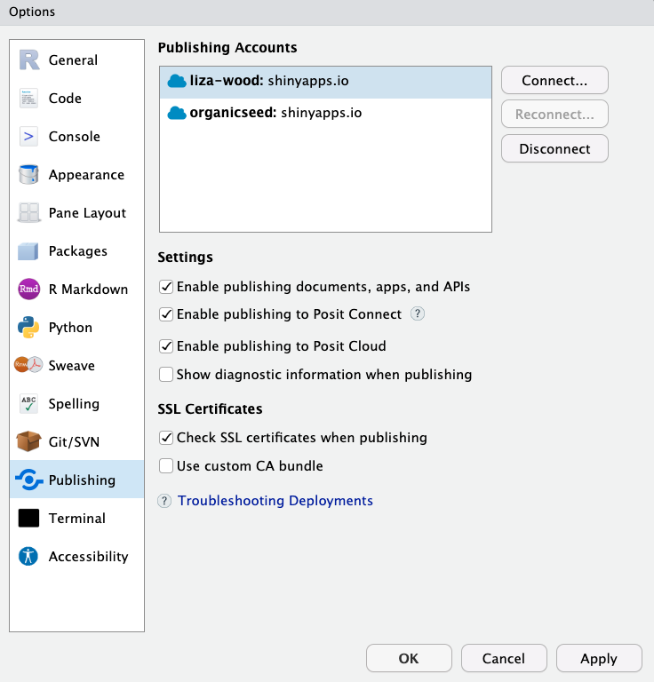

# Overview {-}

This lesson is meant to be a _cursory_ look at creating interactive dashboards using RMarkdown + `flexdashboard` with Shiny integration. Roughly we will...

1. Introduce and discuss interactive sites (5 minutes)
2. Overview of `flexdashboard` and its layout scheme (10)
3. Create a dashboard with static interaction (does not rely on Shiny) (10)
4. Create a dashboard with dynamic interaction (does rely on Shiny) (30)
5. Themes and styles (5)
6. Publishing (10)

**A note on Shiny:** The focus of this lesson is integrating elements of Shiny through the RMarkdown interface, which is _different_ than learning Shiny outright. is among the more popular ways of creating interactive sites because it provides a server on which you can host for free (up to a limit). So it is a popular starting point, though ...

Shiny can be coded in R in (what I understand) are two main ways. One that relies on the coder's ability to design the architecture through scripting in R and X, where you create the user interface, the server, a web app that links them. A second option relies on the flexdashboard package, which makes dashboard creation through RMarkdown much easier on several fronts, including Shiny. This lesson is going to focus on the latter. 

If you want to learn more serious Shiny, start here: https://shiny.posit.co/ 

## Set up

### Package installation 

It will be useful to make sure the following packages are installed, especially if your computer is sometimes buggy downloading packages.

```{r, eval = F}
install.packages('tidyverse')
install.packages('palmerpenguins')
install.packages('plotly')
install.packages('flexdashboard')
# worry less about...
install.packages('networkD3')
```


### shinyapps.io account 

If you want to actually publish the page we make in this lesson, you will need to create a Shiny account and link it to your RStudio. To do this, please complete the following steps: 

1. [create a Shiny account](https://login.shinyapps.io/login?redirect=%2Foauth%2Fauthorize%3Fclient_id%3Drstudio-shinyapps%26redirect_uri%3Dhttps%253A%252F%252Fwww.shinyapps.io%252Fauth%252Foauth%252Ftoken%26response_type%3Dcode%26scopes%3D%252A%26show_auth%3D0) 
2. Follow the instructions for publishing in RStudio by navigating to **Tools** > **Global Options** > **Publishing**. 

```{r, echo = F, fig.align="center", out.width="50%"}

```

Once on this pane, you'll click **Connect** > **shinyapps.io** and follow the instructions to link your account. 

```{r, echo = F, fig.show="hold", out.width=c("48%", "48%")}
knitr::include_graphics(c('img/shinypath.png','img/instructions.png'))
```